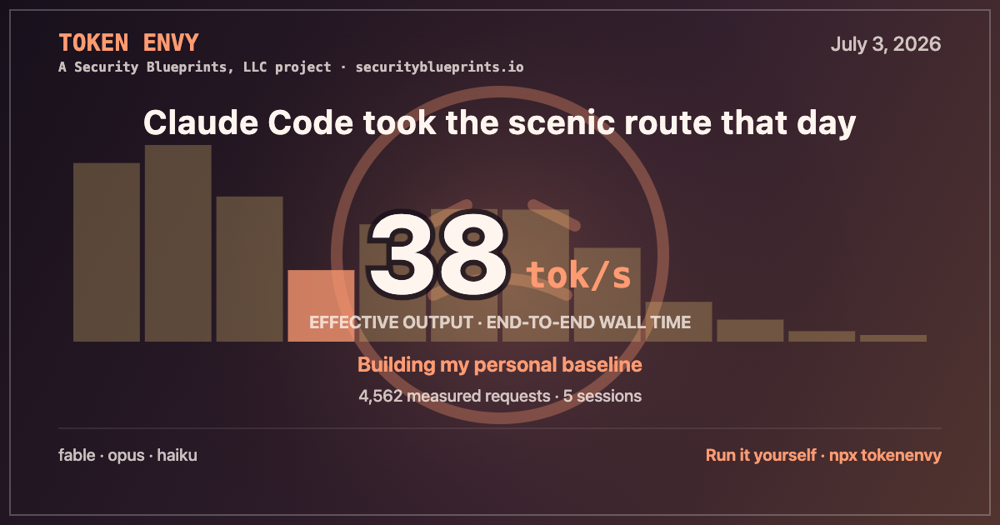

# Token Envy

Token Envy turns local Claude Code transcripts into a private performance dashboard. It charts experienced output speed, model trends, daily distributions, refusal outcomes, and observed usage.

Everything runs locally with Node.js. Prompts stay on your computer.

Token Envy is a [Security Blueprints](https://securityblueprints.io/) project by Niels Provos.



[Watch the 23-second demo](docs/assets/tokenenvy-demo.mp4)

## What it shows

- Effective output tokens per second by model
- Daily medians, interquartile ranges, sample sizes, and eligible confidence intervals
- A 28-day, mix-adjusted Speed Index based on a stable model baseline
- Daily histograms, hourly medians, exclusions, and data-quality counts
- Classifier refusals grouped as attempted, recovered, user-visible, or unknown
- Weekly output, projected usage, and fastest and slowest measured days
- Optional five-hour and seven-day rate-limit percentages
- Privacy-safe daily, weekly, and longitudinal share cards
- Model-filtered refusal warning markers on the longitudinal chart

A daily Speed Index needs 20 measured requests, seven prior measured days, 100
baseline requests, and at least 70% comparable model and output-size coverage.
Five independent sessions add a confidence interval. They do not block the point estimate.

## Install and run

Token Envy requires Node.js 22.13 or newer. Older runtimes exit with upgrade instructions.

```bash
npx tokenenvy
```

The CLI prints the loopback address and opens the dashboard in your default browser. Each launch mints a private access token that stays valid until the process exits. Redeeming it hands the browser a `SameSite=Strict`, HTTP-only cookie, and continued use slides that cookie forward. Reopening the printed URL restores a session that lapsed. Restarting Token Envy mints a new token and retires the previous URL.

The scanner reads `~/.claude/projects/**/*.jsonl` by default. One or more `--logs` options replace that path. Token Envy deduplicates roots and removes nested overlaps. Explicit roots define the complete scan boundary.

```bash
tokenenvy \
  --logs ~/.claude/projects \
  --logs /Volumes/archive/claude-projects \
  --port 4173 \
  --timezone America/Los_Angeles \
  --no-open
```

### CLI options

| Option               | Meaning                                                                      |
| -------------------- | ---------------------------------------------------------------------------- |
| `--logs PATH`        | Replace the transcript root; repeat for multiple roots                       |
| `--port PORT`        | Listen on this loopback port; default is `4173`                              |
| `--timezone ZONE`    | Set calendar-day boundaries with an IANA timezone                            |
| `--no-open`          | Suppress the automatic browser launch                                        |
| `--rescan`           | Re-read live transcripts while preserving archived history and usage samples |
| `-h`, `--help`       | Print CLI help                                                               |
| `install-statusline` | Install the Token Envy status-line hook into `~/.claude/settings.json`       |

The watcher updates the index until you stop the server with Ctrl-C. The derived SQLite index, pseudonymization key, and content-free history live in `~/.tokenenvy`. After 24 hours, stable summaries enter the archive and survive upstream transcript cleanup. Set `TOKENENVY_DATA_DIR` to change this location.

A direct launch of the built server requires `TOKENENVY_LOGS`, formatted as a JSON array of transcript-root paths.

## Optional rate limits

Transcript output measures observed usage. Anthropic sets account quota across Claude web, Desktop, and Code.

Claude Code can send current five-hour and seven-day percentages to a status-line command. Install the Token Envy helper with:

```bash
npx tokenenvy install-statusline
```

Use `tokenenvy install-statusline` when the package is installed globally. The installer writes a `statusLine` entry into `~/.claude/settings.json` (honoring `CLAUDE_CONFIG_DIR`), quotes the executable path so the hook keeps working when Claude Code starts without your shell PATH, and preserves every other key.

Token Envy touches `~/.claude/settings.json` only when you run `install-statusline`, and only the `statusLine` key. If a non-Token-Envy status-line command already exists, the installer refuses to replace it and prints the helper invocation to call from that command yourself.

The helper extracts valid `five_hour` and `seven_day` fields from Claude's JSON and posts them to the loopback server with a per-launch secret. A 150 ms timeout protects the Claude Code process. Samples expire after 15 minutes or at their reset time. Each sample also records the model id from the payload, so the dashboard can report rate limits per model instead of blending quota systems.

## Effective output speed

**Effective output tokens/s** divides reported output tokens by the wall-clock interval between linked transcript events. The interval covers queueing, prompt processing, hidden reasoning, time to first output, generation, and local timestamp effects. The result measures experienced performance. Raw decoder speed covers generation alone.

Skewed distributions call for medians and interquartile ranges rather than averages. Analytics exclude very short, hour-scale, missing-parent, invalid-time, synthetic, and non-positive-token observations. The dashboard reports each exclusion count.

Requests remain provisional while their transcripts grow. They enter the analytics after settling. The selected timezone controls calendar boundaries and daily aggregates. Event identity deduplicates copied or forked transcript history.

## Privacy and security

- Read-only file handles protect source transcripts.
- The database and API contain aggregate metadata. Prompts, responses, commands, tool data, project names, raw paths, refusal explanations, and raw identifiers stay in the source transcripts.
- Locally keyed HMAC digests pseudonymize source, session, request, and event identifiers. Pseudonymization differs from encryption.
- The server binds to `127.0.0.1` and accepts explicit loopback Host and Origin values. It omits CORS headers.
- Browser sessions use a per-launch token that remains valid for the life of the process. Anyone able to read the printed URL can reopen the dashboard until Token Envy exits. Status-line ingestion uses a separate per-launch bearer secret.
- Automatic traffic stays on loopback. The app collects zero analytics and telemetry.
- Share exports use an allowlisted aggregate record and require an explicit user action.

Anyone with access to your local account may read the derived index. Standard workstation security still applies.

## Share your results

Choose a measured day, select **Share this day**, and export a PNG. Friendly and spicy voices control the tagline. The mood slider changes wording, expression, and palette while measurements stay fixed.

Daily cards contain aggregate statistics, model mix, a histogram, explicit refusal lower bounds, project attribution, and the `npx tokenenvy` command. Weekly recaps add a mix-adjusted Speed Index, the fastest and slowest days, request and session activity, output tokens, and the leading model family.

The longitudinal chart marks explicit classifier refusals with warning triangles. Filled coral markers identify user-visible outcomes. Amber outlines identify recovered or unresolved attempts. Gray dashed outlines identify signals whose model family is unavailable. Counts remain lower bounds because the logs expose explicit signals only.

Choose **Share this trend** to create a Claude Weather card for the current range and visible model families. The card summarizes typical model and output-size adjusted variation around a robust trend. It also shows measured output tokens, coverage, refusal signals, Security Blueprints attribution, and `npx tokenenvy`. Friendly and spicy voices share the same frozen measurements. The five-stop mood slider changes only the words, weather art, and palette.

Browser support controls native sharing. **Copy image** and **Download PNG** work as fallbacks, with composer shortcuts for X, Bluesky, and LinkedIn.

Share actions link to the public npm package page. Release builders can set another public product URL:

```bash
PUBLIC_TOKENENVY_URL=https://example.com/tokenenvy npm run build
```

The URL must use `https://` and exclude credentials. Invalid values omit the product link.

## Development

Build and link a local checkout:

```bash
npm install
npm run build
npm link
tokenenvy
```

Start the development server with `npm run dev`.

`npm link` exposes the CLI through a bin symlink, and `tokenenvy install-statusline` records that symlink path so the installed hook keeps working across rebuilds. After moving this checkout, run `npm link` again and re-run `tokenenvy install-statusline`; it updates the recorded hook path automatically.

Run the checks before publishing:

```bash
npm run format:check
npm run lint
npm run check
npm test
npm run build
npm run test:package
```

Use `npm run format` to apply formatting. The package test builds the npm tarball, installs it in a temporary project, scans fixtures from two transcript roots, verifies authenticated access, and checks clean shutdown. Keep tests and fixtures in temporary transcript and state directories.

## License

[Apache License 2.0](LICENSE). Copyright 2026 Niels Provos. See [NOTICE](NOTICE) for project attribution.
